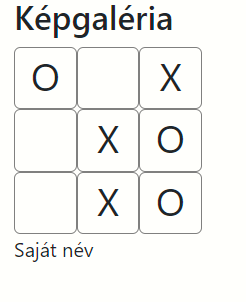

# TicTacToe feladat órai megoldása MVC elvek szerint

##  MVC alapok
A programról úgy gondolkodunk, mint állapotok egymásutánjáról. Minden felhasználói vagy egyéb esemény során a program egyik állapotból a másikba kerül. 

### View  -  a "szép"
- Az adatok megjelenítése a felületen
- Itt kezdeményezi a felhasználó a kommunikációt. Események kiváltása, és asaját események létrehozása

**Az ElemView osztály a játék egyetlen kis négyzetét jeleníti meg. Erre a négyzetre akkor tudunk kattintani, ha üres, és beleírhatunk X-et, vagy O-t attól függően, hogy melyik jel következik. **
**Rendelkezik egy kattintás eseménnyel, mely kiváltja a saját eseményt. **
**Rendelkezik egy seErtek metódussal, mely az elem kövepébe helyez el egy paraméterében megadott jelet. **

### Modell  - az "okos"
Határozzuk meg, hogy mi az ami meghatározza a programunk aktuális állapotát. Milyen változók, adatszerkezetek írják ezt le? 
- A program következő állapotának előállítása
- Műveletek elvégzése az adatokaton -
- programozói, matematika logika

**A konkrét feladatunkban a program állapotát az jellemzi, hoyg hányadik lépésnél tartunk, azaz ki következik. Továbbá jellemzi majd egy lista is, amiben tároljuk, hogy az egyes négyzetekben milyen jel van. 
A lista egy jellemző állapota pl.: ["X", "O",".",  ".","O",".", "X",".","."] **

### Controller - a "parancsnok, irányító"
Kapcsolatot tart a View és a Modell között, csak rajta keresztül kommunikálhat a két osztály egymással. 
- példányosítja a Modell osztályokat
- példányosítja a View osztályokat
- feliratkozik a View eseménykezelőire
- meghívja a Model és a View osztályok megfelelő tagfüggvényeit.

Jellemzően a program belépési pontja a main.js, itt példányosítjuk a Controllert. 
